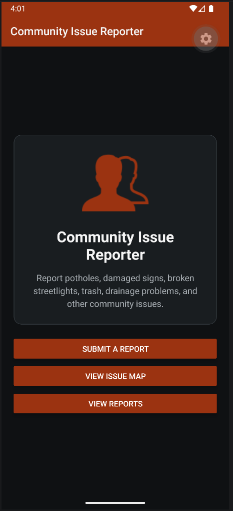
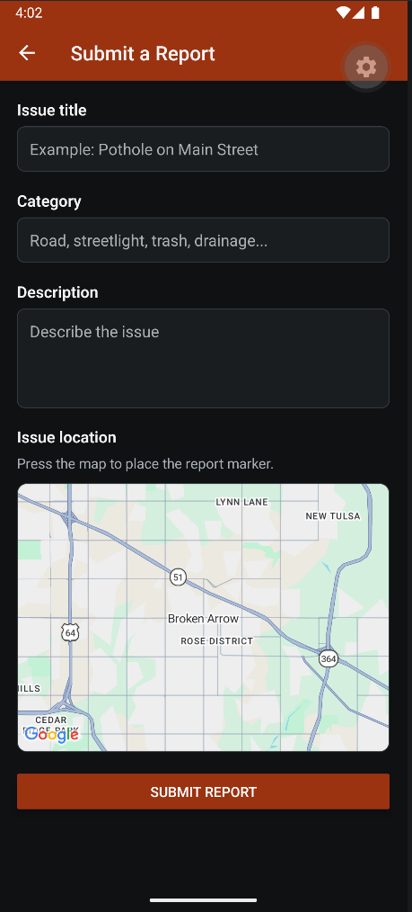
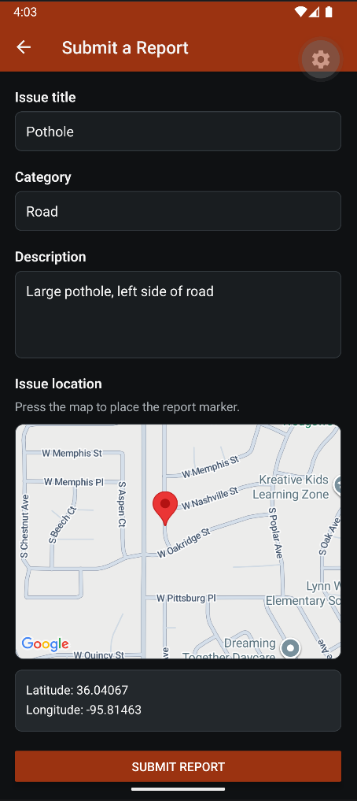
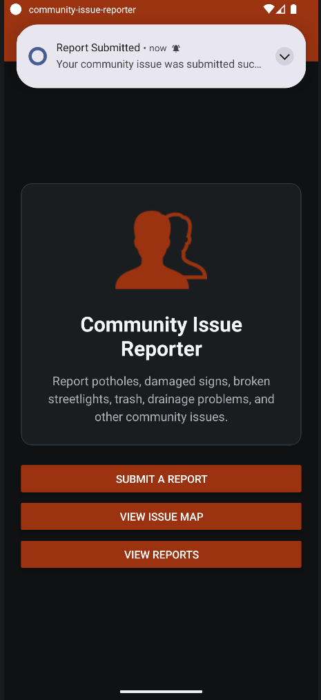
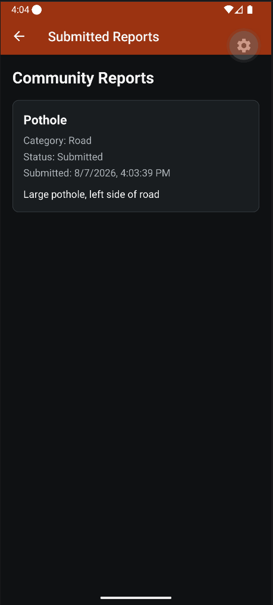
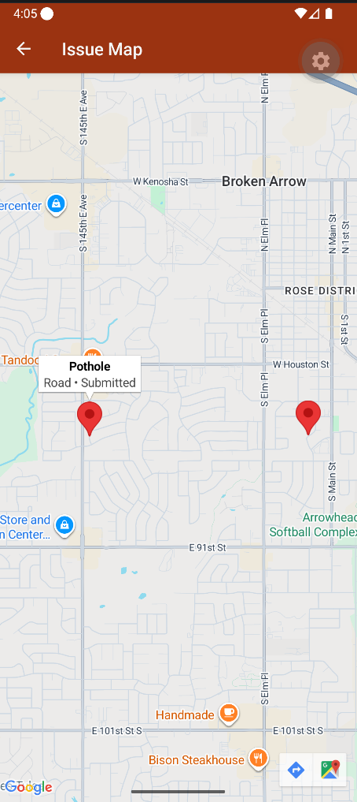
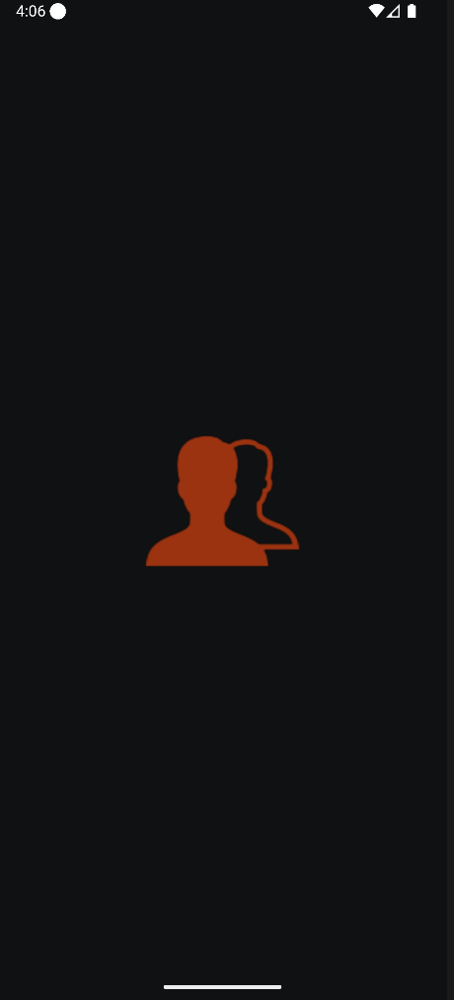
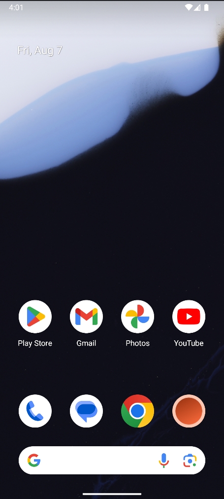

Community Issue Reporter

Community Issue Reporter is a React Native mobile application that allows users to report issues in their community, such as potholes, damaged signs, trash, streetlight problems, and drainage issues.

The app allows users to enter issue information, select a location on a Google Map, save the report to Firebase, and receive a local notification after submission.

Features
  Four application screens
  Submit community issue reports
  Google Maps integration
  Select report locations using map markers
  Firebase Realtime Database storage
  View previously submitted reports
  View submitted reports on a map
  Local notifications after report submission
  Dark themed interface

Built With
  React Native
  Expo
  TypeScript
  Firebase Realtime Database
  Google Maps
  React Navigation
  Expo Notifications

Running the Application
  Install dependencies:
  npm install
  Start the development server:
  npx expo start --dev-client
  For an Android development build:
  npx expo run:android

Project Purpose
This project was created as a final project for ACS-5413. The goal was to combine mobile navigation, user input, maps, Firebase storage, local notifications, and application styling into one functional mobile application.

Screenshots

Home Screen

Submit Report

Test Report

Submission Notification

Submitted Reports

Issue Map

Splash Screen

Application Icon

